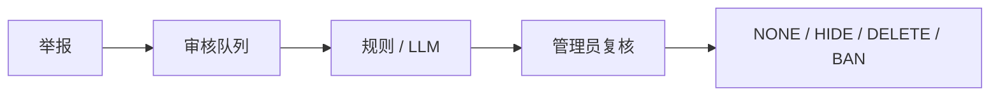

# De-Moderation

**De-Moderation 是为 [De-discussion](https://github.com/Mingjie-Mao/De-discussion) 校园论坛开发的内容审核后端。**

系统结合 **规则引擎、LLM 辅助审核和人工复核**。用户举报内容后，系统创建审核案件，由规则或模型生成审核建议，最终由管理员决定是否隐藏、删除或封禁。

**Java 21 · Spring Boot 3.5 · PostgreSQL（本地 16 / 演示 Neon 18）· Spring AI · Gemini · Docker · Testcontainers**

## Online Demo

- [管理员审核工作台](https://de-moderation-review-demo.pages.dev/)
- 后端 API：<https://p01--de-moderation-api--z48dx52bgz5k.code.run>

Android 论坛、App 内管理员审核与管理网页共用同一个后端。普通用户通过 App 注册和登录，帖子、评论与图片写入真实数据库和存储桶。App 选择 Admin 后需登录服务器管理员账号，可处理案件、模型建议、申诉与审计。

## Features

- 举报聚合与持久化审核队列
- Rule Engine / LLM 可插拔审核引擎
- Human-in-the-loop 管理员复核
- JWT、Refresh Token 轮换与权限控制
- LLM 超时、熔断、限流退避与规则降级
- 审核结果、模型调用和管理员操作审计
- S3 兼容图片存储，线上演示使用 Cloudflare R2
- 点赞、收藏、关注与跨设备持久化
- 虚拟 Heat Market：服务器钱包、持仓、交易记录和排行榜
- Testcontainers 集成测试
- 可选案件调查 Agent，查询作者历史、同规则已裁决案例和规则

## Evaluation

在同一套 192 条中英双语数据上：

| Engine | Macro-F1 | ESCALATE Recall |
|---|---|---|
| Keyword | 0.286 | 0.000 |
| Gemini v1 | 0.617 | 0.056 |
| Gemini v2 | **0.924** | **0.778** |

v1 和 v2 使用相同模型与代码，只修改 Prompt。192 条数据集用于 Prompt 调优；上表每个引擎测量一次。

在 Prompt 冻结后编写的 72 条留出集上，每个引擎测量三次：

| Engine | Macro-F1（均值 ± 半极差） | Pair Accuracy |
|---|---|---|
| Gemini v1 | 0.597 ± 0.016 | 0.457 |
| Gemini v2 | **0.984 ± 0.003** | **0.972** |

Pair Accuracy 要求一组最小对的两条样本都答对。这些自建数据用于比较引擎表现，**不代表真实线上准确率**。

详细评测见 [evaluation-notes.md](docs/evaluation-notes.md)。

## Architecture



模型只生成建议，**最终处置始终由管理员决定**。外部模型失败时自动降级到规则引擎，不阻塞审核流程。

## Investigation Agent

管理员可以针对案件主动启动调查助手，默认关闭。

助手只能调用只读工具：

```text
caseDetail
authorHistory
similarResolvedCases
ruleText
```

用于生成带证据的案件简报，不拥有内容修改或处罚权限。简报和模型调用会记录到审计中。

详细设计见 [investigation.md](docs/investigation.md)。

## Quick Start

需要 JDK 21、Docker 和 Node.js 22.13+。复制配置后填写 `DB_PASSWORD`、`JWT_SECRET`（至少 32 字节，可用 `openssl rand -hex 32` 生成），以及 `ADMIN_USERNAME` / `ADMIN_PASSWORD`。

```bash
cp -n .env.example .env
# 填好 .env 后启动

docker compose up -d
set -a && . ./.env && set +a
mvn spring-boot:run
```

- 线上管理端：[de-moderation-review-demo.pages.dev](https://de-moderation-review-demo.pages.dev/)
- Swagger：<http://localhost:8080/swagger-ui.html>（本地开发开启）

管理员由启动配置创建，普通用户在 App 注册；两者均使用服务器账号登录。LLM 为可选配置；启用时填写 `AI_CHAT_MODEL`、`GEMINI_API_KEY`、`GEMINI_MODELS` 和 `MODERATION_ENGINE`。

## Testing

```bash
mvn verify
```

集成测试通过 Testcontainers 运行真实 PostgreSQL 和 S3Mock，验证数据库与 S3 存储接口。真实模型与真实存储桶测试需单独配置凭据。

## Documentation

- [Architecture](docs/architecture.md)
- [Evaluation](docs/evaluation-notes.md)
- [Investigation Agent](docs/investigation.md)
- [Reliability](docs/reliability.md)
- [Security](docs/security-decisions.md)
- [Demo Deployment](docs/production-runbook.md)
- [Full Project Report](docs/backend-project-report.zh-CN.md)
