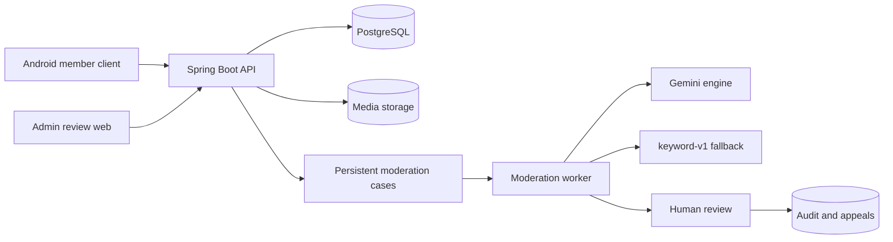

[](backend-project-report.md)
[](backend-project-report.zh-CN.md)

# De-Moderation 后端项目报告

> 更新时间：2026 年 10 月 3 日
> 仓库：`De-moderation`
> 分支：`codex/moderation-hardening`（改动未提交）
> 报告范围：后端、数据库、AI 审核、管理员网页、核心测试和面试演示

## Northflank 迁移验收（2026-10-05）

当前演示沿用原 Neon 数据库和 R2 桶。新 API 已验证真实成员和管理员登录、11 条 ANU 帖子、Gemini 建议、人工复核与审计；Pages 已重新部署，Android 模拟器中两个账号均登录并加载了 11 条真实帖子。迁移证据与热请求延迟限制见[部署说明](../deploy/northflank/README.md)。


## 1. Project Overview

De-Moderation 是校园论坛 `De-discussion` 的后端和内容审核系统。Android 客户端使用真实服务器成员账号，提供注册、登录、发帖、评论、图片、举报和申诉界面。Member 演示账号为 `1234` / `1234`；Admin 模式需登录真实服务器管理员账号，可在 App 或独立网页处理审核案件、模型建议、审计、裁决与申诉。

项目的核心原则是：**AI 负责初步分类，人负责最终决定。**

这样设计不是为了让模型自动删帖，而是为了同时解决三个问题：

1. 审核任务不能因为进程退出、并发竞争或外部模型故障而丢失。
2. Gemini 不可用时，系统仍能依靠规则引擎和人工审核继续工作。
3. 每次建议、裁决、改判和申诉都能追踪、撤销和解释。

审核员还可以在裁决前，让一个可选的只读助手去查作者的历史处理记录和同规则先例（见 6.3）。它只给建议、不做决定，默认关闭，目前还没有部署到公开演示环境。

目前项目已经具备完整的演示链路：Cloudflare Pages 管理网页调用 Northflank 后端，后端连接 Neon PostgreSQL，并在可用时调用 Gemini。账号、帖子、评论、举报、审核、申诉、通知和管理员操作都已经落到真实数据库中，不是前端假数据。

当前公开地址：

- 管理员网页：`https://de-moderation-review-demo.pages.dev`
- 后端 API：`https://p01--de-moderation-api--z48dx52bgz5k.code.run`
- 健康检查：`https://p01--de-moderation-api--z48dx52bgz5k.code.run/actuator/health/readiness`

本项目按简历与面试演示维护。真实 Gemini 调用、S3 媒体持久化、V13 迁移、评论分页和管理端会话已验证。独立云监控、Resend 接入、定时备份/桶复制框架、Kubernetes 和告警部署配置已精简移除；这些不作为项目完成的前置条件。保留基本健康检查、日志、CI 和按需执行的手动备份/恢复。最新部署步骤见 [演示部署指南](production-runbook.md)。

## 2. System Architecture

| Component | Technology | Responsibility |
|---|---|---|
| Backend | Java 21、Spring Boot 3.5.16 | REST API、认证、论坛和审核流程 |
| Database | PostgreSQL、Flyway、JPA/Hibernate | 业务数据、持久化队列、审计和 AI 调用记录 |
| AI moderation | Gemini、Spring AI、Resilience4j | 语义审核建议、重试、断路和降级 |
| Rule engine | `keyword-v1` | 确定性基线和无外部依赖兜底 |
| Admin web | React 19、Next 16 API、vinext | 人工审核、改判和申诉处理 |
| Client | Android，独立仓库 `De-discussion` | 论坛交互与真实管理员审核 |
| Health | Actuator、Micrometer | 基本健康状态和应用指标 |
| Deployment | Docker、Caddy、Northflank、Cloudflare Pages | 打包、HTTPS 和公开演示 |



后端使用同一个 PostgreSQL 保存业务数据和审核队列。worker 从数据库领取任务，不依赖单独的内存队列，因此服务重启后案件仍然存在。自动分析只产生建议，内容隐藏、删除或封禁必须由管理员确认。

## 3. Core Forum Functions

### 3.1 Authentication

公开注册只能创建 `MEMBER`，不能通过请求字段获取管理员权限。登录成功后返回一小时有效的 JWT access token 和 30 天 refresh token。refresh token 每次使用都会轮换，数据库只保存 SHA-256 摘要，旧 token 不能重放。

系统支持改密码、退出全部设备和一次性密码重置。改密码或退出全部设备会增加 `tokenVersion`，让已有 access token 立即失效。密码使用 BCrypt 保存；管理员由启动配置在账号不存在时创建，不会把已有同名成员自动提升为管理员。

密码重置 API 和一次性令牌已实现，但演示关闭邮件发送，无法通过邮件完成找回密码。

### 3.2 Forum

帖子支持创建、公开读取、游标分页、作者编辑和软删除。评论支持顶层评论、嵌套回复、编辑和软删除，最大深度为 10。普通用户看不到已删除内容，管理员复核历史案件时仍能读取原内容。

feed 使用 `(created_at, id)` keyset cursor，而不是 offset。新帖子插入顶部时不会改变后续页边界，因此能避免重复和漏项。

### 3.3 User and Notifications

用户可以查看和修改自己的显示名和简介，也能读取其他成员的公开资料。资料更新使用真正的 PATCH 语义：未提交的字段保持原值，只有明确提交空值才清空内容。

站内通知覆盖审核结果、申诉状态和管理员待处理事项，支持列表、未读数量和标记已读。目前通知通过客户端轮询获取，没有 WebSocket 或系统推送。

### 3.4 Media

媒体接口只接受 JPEG 和 PNG，默认限制 8 MiB 和 2,000 万像素。服务会识别真实格式、读取尺寸、完整解码并重新编码，避免伪装文件、像素炸弹和原始元数据泄露。

只有上传者能把图片挂到自己的帖子或评论上。公开下载只允许读取仍被可见内容引用的图片，未发布图片和隐藏内容的图片不能通过猜 UUID 直接访问。图片存在哪里是部署配置，由同一个存储接口决定：本地目录，或任何 S3 兼容的存储桶（AWS S3、Cloudflare R2，或互操作模式下的 GCS）。公开演示环境已使用 `MEDIA_BACKEND=S3`，图片持久化到私有 Cloudflare R2 桶，不依赖 Render 临时目录。可选的每小时孤儿扫描会删除超过一天、没有任何帖子或评论引用的图片，但绝不动被隐藏或删除内容所用的图片，因为这些裁决可以撤销。

## 4. Moderation Workflow

一条举报会经过下面六步：

1. 用户举报帖子或评论，系统检查目标、权限、重复举报和频率限制。
2. 同一目标的多个举报聚合到一个未关闭的 moderation case。
3. worker 从 PostgreSQL 领取 `QUEUED` 案件并改为 `ANALYSING`。
4. Gemini 返回 `ALLOW`、`REMOVE` 或 `ESCALATE`；模型失败时使用 `keyword-v1`。
5. 案件进入人工复核，管理员选择 `NONE`、`HIDE`、`DELETE` 或 `BAN`。
6. 最终决定写入审计记录，之后仍可改判或由受影响作者申诉。

案件状态机保持简单：

```text
QUEUED -> ANALYSING -> AWAITING_REVIEW -> RESOLVED
```

- `QUEUED`：案件已经持久化，等待 worker。
- `ANALYSING`：worker 已领取，正在生成建议。
- `AWAITING_REVIEW`：自动建议完成，等待管理员。
- `RESOLVED`：管理员已经做出最终决定。

管理员认领是案件上的分配信息，不额外增加状态。这样案件进度和人员分工不会混在同一个状态机里。

## 5. Key Backend Design Decisions

### 5.1 Concurrent report aggregation

多个用户可能同时举报同一内容。如果只做“先查询、再插入”，两个请求都可能看到“没有案件”，随后各建一条记录。

项目用 PostgreSQL 部分唯一索引保证同一目标只能有一个未解决案件，并通过 `ON CONFLICT DO NOTHING` 处理竞争。`report_count` 使用单条 SQL 原子加一，避免并发请求相互覆盖。数据库约束是最后保证，应用层重试负责把举报加入已经存在的案件。

### 5.2 Worker concurrency

多个 worker 使用 `SELECT ... FOR UPDATE SKIP LOCKED` 并行领取案件。被一个 worker 锁定的记录会被其他 worker 跳过，因此不会重复处理，也不会让所有实例串行等待。

领取事务只负责选中案件并写入 `ANALYSING`，随后立即提交。模型调用在事务外完成，避免外部 API 的长延迟占用数据库锁和连接。

### 5.3 Failure recovery

worker 可能在写入 `ANALYSING` 后崩溃。系统定时查找超过阈值仍未完成的案件，把它们重新放回队列。这样一次进程退出不会让案件永久卡住。

模型超时、限流或返回错误不会破坏案件状态：系统先重试或降级，最终无法自动处理时将案件交给人工，而不是停留在半完成状态。

### 5.4 Database consistency

Flyway 完全负责数据库结构，Hibernate 只执行 `validate`。部分唯一索引、外键、CHECK、JSONB 和原子更新负责保证关键约束；软删除让举报、案件和审计记录仍能引用原内容；追加式 audit log 保存每次建议和决定，不覆盖历史。

`open-in-view` 被关闭，查询必须在服务层明确完成。案件列表和内容列表使用预取并配有 SQL 数量测试，防止 N+1 查询重新出现。

## 6. AI Moderation Design

### 6.1 Two engines

| Engine | Strength | Role |
|---|---|---|
| `keyword-v1` | 确定、快速、没有外部依赖 | 基线、兜底和故障期间继续运行 |
| Gemini | 能理解语义、多语言和上下文 | 生成更准确的审核建议 |

两个引擎实现同一个 `ModerationEngine` 接口。worker 和评测程序只依赖这个接口，因此可以在不改业务流程的情况下切换模型、提示词版本或规则引擎。

Gemini 引擎以“模型名/提示词版本”注册，例如 `gemini-3.5-flash-lite/v2`。模型和提示词都会影响结果，记录完整名称才能把生产调用、评测和成本对应起来。

### 6.2 Reliability

| Protection | Behaviour |
|---|---|
| Timeout | 单次模型调用最多 30 秒 |
| Circuit breaker | 最近调用失败率过高时暂时停止请求供应商 |
| Rate-limit retry | 对 429 最多重试 4 次，指数退避并加入随机抖动 |
| Error classification | 无效 Key 等不可恢复错误不会盲目重试 |
| Output validation | 验证 JSON、decision、confidence、rationale 和 rule codes |
| Correction retry | 输出错误时把具体原因反馈给模型，再纠正一次 |
| Fallback | Gemini 最终失败后使用 `keyword-v1` |
| Human escalation | 自动引擎都无法处理时仍进入人工审核 |

每次生产模型调用都会记录模型、提示词版本、内容哈希、状态、尝试次数、token、延迟、原始回答和错误原因。这样可以分析成本和稳定性，也能在争议发生时还原当时的自动建议。

带图片的案件会把规范化后的图片和文字一起交给 Gemini。关键词引擎忽略图片但仍能处理文字，因此多模态模型不可用时队列也不会堵塞。

### 6.3 Case investigation

审核流水线一次只判断一条内容。它没法告诉审核员：这是作者第一次还是第四次违规，同一条规则以往是怎么执行的——因为案件按内容索引，而不是按人。一个可选的调查助手（默认关闭）专门回答这两个问题。

审核员发起调查后，服务先取出作者近 90 天内被处理过的记录和该案件规则下的先例，再允许模型最多进行五轮只读查询，然后必须写出简报：建议的处置、代替置信度数字的证据强度档位、反对这个建议的最有力理由，以及它依据的案件。每一个被引用的案件都必须是查询确实返回过的；否则简报会被退回重写一次，仍不合格就标记为"没有结论"。超时或熔断打开时，返回标明"未完成"的简报，而不是报错。

| Guarantee | How it is enforced |
|---|---|
| 查询工具不能改变裁决或内容 | 每次查询都在只读事务里执行；隐藏内容或封禁账号仍然只有 `AdminModerationService.decide` 一条路径 |
| 不能被指向别的案件 | 被调查的案件由循环传给每个工具，模型的参数里从不指定它 |
| 调用成本有上界 | 每位审核员每小时最多发起 60 次调查；已存储的简报免费返回，被拒绝的请求不计次数 |
| 可审计 | 简报写入审计日志并记在发起调查的管理员名下；每次模型调用以 `investigator/<prompt 版本>` 记入 `ai_invocations` |

历史实验在 16 个场景上、每个场景跑三次（`gemini-3.5-flash-lite`，prompt `inv-v4`）测得：0.875 的建议是审核员能够辩护的，0.938 的场景三次答案完全一致，0.813 的简报引用了案件真正取决的证据；每次调查约 2,100 个 prompt token、约一次查询，大约是一次审核判定 token 用量的 3.6 倍。有两个失败可以稳定复现，如实记录而没有打补丁：它不会率先建议封禁；即使驳回率显示应当相反，它仍会被先例带偏。设计、prompt 版本历史和测量细节见 [investigation.md](investigation.md)。

## 7. Evaluation

评测集包含 192 条中英双语样本，其中英文 122 条、中文 70 条，标签为 `ALLOW`、`REMOVE` 和 `ESCALATE`。内容覆盖普通讨论、辱骂、垃圾广告、违法内容和需要上下文判断的边界案例。

| Engine | Macro-F1 | ALLOW Recall | REMOVE Recall | ESCALATE Recall |
|---|---:|---:|---:|---:|
| `keyword-v1` | 0.286 | 1.000 | 0.106 | 0.000 |
| Gemini v1 | 0.617 | 0.978 | 0.939 | 0.056 |
| Gemini v2 | 0.924 | 0.989 | 0.970 | 0.778 |

最重要的结果不是“换了更大的模型”，而是同一个模型只调整任务定义后，Macro-F1 从 **0.617 提升到 0.924**，`ESCALATE` recall 从 **0.056 提升到 0.778**。

v1 更接近在问：

> 这段内容是否违反规则？

v2 改成：

> 这个案件能否在不经过人工复核的情况下安全关闭？

前一个问题容易把求助、引用辱骂和缺少上下文的内容直接判为安全；后一个问题把“不确定但值得人看”的内容正确升级。提升来自任务定义改变，而不是简单把提示词写得更长。

2026 年 8 月 25 日使用当前 Key 和模型别名复测时，Gemini 在首轮成功返回的 184 条上 Macro-F1 为 0.919，8 条超过 30 秒预算；单独重跑这 8 条后全部成功。分类表现没有明显漂移，但供应商仍有长尾延迟，因此超时、降级和人工复核不能移除。

这些结果不能当成真实线上准确率：数据规模较小，不来自完整生产流量；v2 看过 v1 在同一数据上的错误；模型重复运行也会有轻微漂移。

### 留出集

第二份数据集写于 2026 年 9 月 12 日，在 prompt 冻结之后，写任何 prompt 时都没有看过：72 条样本组成 36 组最小对，每组是同一篇帖子写两遍、只改一处、正确答案不同。一组只有两半都答对才算对，这正是逐样本准确率问不出来的问题。每个引擎跑三次，± 是观测极差的一半。

| Engine | Macro-F1 | ESCALATE Recall | 成对准确率 | 答案不稳定 |
|---|---:|---:|---:|---:|
| `keyword-v1` | 0.217 ±0.000 | 0.000 | 0.000 | 0 / 72 |
| Gemini v1 | 0.597 ±0.016 | 0.067 | 0.457 | 2 / 72 |
| Gemini v2 | 0.984 ±0.003 | 1.000 | 0.972 | 0 / 72 |

v1 的 ESCALATE 失败在五周后新写的数据上复现了（0.056 → 0.067），说明当初改写 prompt 所修的问题真实存在，而不是第一份数据集的偶然。v2 的 0.984 仍然不是线上准确率的估计：留出集的标签遵循的正是 v2 prompt 里写明的判定口径，所以它的 ESCALATE 召回接近于定义使然。第三个 prompt 版本 v3 已在 9 月 13 日于同一批 72 条样本上测过，分类结果与 v2 完全一致——macro-F1 同为 0.986，配对准确率同为 0.972，72 条里没有一条被修好、也没有一条被弄坏——同时把判定理由写成了内容本身的语言：28 条中文样本全部用中文解释，而 v2 只有 3 条，代价是多 11.6% 的 prompt token。那次运行也在隔天重测了 v2，0.986 对 0.984，差距落在前一天自身的波动范围内。上面 192 条数据集的表格仍然只是单次运行。两份数据集都提供不了估计真正需要的东西——真实管理员裁决——[investigation.md](investigation.md) 里描述的裁决语料导出，是开始收集它的第一步。

## 8. Security

| Area | Design |
|---|---|
| Authentication | BCrypt、HS256 JWT、refresh-token rotation、一次性 reset token、`tokenVersion` |
| Authorization | `MEMBER`/`ADMIN`、资源归属校验、管理员路由整体保护 |
| Account state | 每次认证重新读取当前角色、封禁状态和 token 版本 |
| API policy | 默认拒绝，只明确开放公开读取、登录和健康概要 |
| CORS | 只允许环境变量配置的管理网页来源，不使用跨域 cookie |
| Media | 格式和像素验证、重新编码、上传者归属和公开可见性校验 |
| Rate limiting | 登录、注册、刷新、重置、帖子、评论和举报均有上限 |
| Error handling | RFC 7807 统一错误；登录失败不区分账号不存在或密码错误 |

JWT 密钥没有默认值且至少 32 字节，没有配置时程序直接启动失败。每次认证都会重新读取用户，因此账号被封禁、管理员被降级或执行“退出所有设备”后，旧 JWT 不需要等到自然过期才失效。

生产 profile 关闭 Swagger；当前演示默认不暴露 Prometheus；健康概要可以公开，但详细组件信息需要管理员权限。管理员网页把 token 放在 `sessionStorage`，关闭浏览器会话后消失。

## 9. Admin Review and Appeals

管理员网页提供待审核、已处理和申诉三个视图。管理员可以查看原文、图片、举报数量、AI 建议、置信度、规则编号、SLA 和完整审计记录，并认领或释放案件。

开启调查助手后，案件详情还会显示简报：建议、证据强度、反面理由，以及每个被引用的案件——点击即可打开该案件，并能返回正在裁决的那个案件。打开案件从不会自动发起调查；必须由审核员主动点击，新举报出现后重新调查也是一次明确的、要计费的选择。

最终动作包括：

- `NONE`：完成审核，不改变内容。
- `HIDE`：软删除内容。
- `DELETE`：执行删除语义并保留审计记录。
- `BAN`：隐藏内容并封禁作者。

决定时数据库会锁定案件。如果案件已经被另一名管理员认领，第二个人不能直接裁决。已解决案件允许改判，系统先撤销旧动作再应用新动作，但不会删除旧审计记录。多个案件共同维持同一账号封禁时，撤销其中一个案件不会错误解除其他案件造成的封禁。

受影响作者可以对 `HIDE`、`DELETE` 或 `BAN` 提交申诉。管理员撤销申诉时复用原案件改判逻辑，恢复内容或账号，并向相关人员发送站内通知。

## 10. Testing

项目使用 Testcontainers 启动真实 PostgreSQL 16，而不是用 H2 代替。原因是实现依赖 PostgreSQL 的部分唯一索引、JSONB、`ON CONFLICT` 和 `SKIP LOCKED`，H2 无法可靠验证这些行为。

| Test area | Main coverage |
|---|---|
| Authentication and security | 登录、JWT、refresh rotation、重放、封禁、权限和统一错误 |
| Forum APIs | 帖子、评论、分页、归属、软删除、深度和频率限制 |
| Moderation workflow | 举报聚合、worker 领取、裁决、改判和停滞回收 |
| Concurrency | 部分唯一索引、原子计数、案件认领和多 worker 行为 |
| AI failure handling | 超时、429、断路器、错误输出、纠正重试和降级 |
| Appeals and notifications | 申诉权限、撤销、状态恢复和通知 |
| Media | 格式、像素、重新编码、归属和访问控制 |
| Media storage | 两个存储后端必须同样满足的一份共享契约，分别对本地目录、S3Mock 运行，以及——在 `.env` 的 S3 段填好时——对部署自己的存储桶运行 |
| Media sweep | 孤儿扫描会删除什么，以及——真正要紧的断言——它拒绝删除什么 |
| Case investigation | 工具白名单、只读事务、步数预算、引用校验、共享熔断、端点权限与限流，以及工具调用适配器本身 |
| Evaluation harness | 成对评分、多次运行离散度、答案不稳定，以及留出集自身的不变量 |
| Database and API policy | Flyway V1–V13、Actuator、Swagger、N+1 查询数量 |

当前 S3 后端通过 Testcontainers 对 S3Mock 测试，验证上传、读取、删除和列举等契约；它不能证明部署所用服务商对 region 和 path-style 寻址的兼容性。配置 `MEDIA_S3_BUCKET` 后，真实桶契约测试会对部署自己的存储桶运行。当前测试使用 `adobe/s3mock:4.7.0`，公开演示使用 R2；模拟服务与真实桶是两个验证层次。

留出集本身也在测试之下。它是没有其他东西会去碰的产物——手工编辑，又是每个公开数字的分母；如果某组两半标签相同，或者某条样本是从调参用的数据集里抄来的，它就会悄无声息地出错。`HeldOutDatasetTest` 断言这些性质，而不是靠信任。

2026 年 10 月 3 日精简后验证（只列有对应证据的结果）：

- 针对性测试：23 项，0 失败、0 错误、0 跳过；覆盖认证、会话、一次性令牌、评论边界和生产监控配置。
- 数据库：目标演示已迁移至 V13；本地集成测试使用 PostgreSQL 16，目标 Neon 使用 PostgreSQL 18。
- Compose：配置解析通过，只包含 PostgreSQL、后端、管理网页和 Caddy 四项服务。
- 线上检查：readiness 返回 HTTP 200 / `UP`，管理网页 HTTP 200，Gemini v2 为活动引擎；匿名 Prometheus 请求被拒绝。
- 验证记录：本机私有 `backups/project-simplification-20261003.validation.json`，不包含凭据。

这 23 项不是全量测试数，也不表示本次重新执行了真实模型、存储桶或全量压测。GitHub Actions 配置保留；当前改动未提交、未推送，不能表述为本次云端 CI 已通过。

## 11. Deployment and Operations

当前公开演示架构是：

```text
Cloudflare Pages
        |
        v
Northflank Spring Boot API
        |
        v
Neon PostgreSQL
        |
        +--> Gemini, with keyword-v1 fallback
```

| Layer | Current status |
|---|---|
| Admin web | Cloudflare Pages HTTPS，公开可访问 |
| Backend | Northflank 免费 Docker 实例，readiness 为 `UP` |
| Database | Neon 托管 PostgreSQL，已迁移至 V13 |
| AI | Gemini v2 正常，`keyword-v1` 兜底 |
| Secrets | 本地 `.env` 被 Git 忽略；云端使用平台环境变量 |
| CI | 后端 verify、Docker build、网页 lint/build |

仓库提供简化的四服务 Compose、Caddy HTTPS、手动备份/恢复脚本和 CI。

**恢复。** 这一项已经验证。`scripts/restore-drill.sh` 把 dump 恢复到一个临时 PostgreSQL 容器里，检查校验和、Flyway 历史、核心表、约束数量和一条引用完整性不变量。对本项目数据库的真实 dump 执行时全部通过；对故意损坏的副本执行时报出失败并以非零状态退出——只会通过的检查不算检查。2026 年 9 月 13 日重跑结果相同：真实 dump 的每项检查都通过，损坏副本报出 14 个失败、退出码为 1。

**负载。** 最新保留的本地 `load/k6-mixed-summary.json` 显示八项阈值中七项通过：p95 为浏览 7 ms、写入 18 ms、举报 22 ms、上传 432 ms、管理员列表 71 ms；浏览与管理员请求失败率为零。登录失败率为 92.3%，主要因每 IP 登录限流；脚本虽单独统计 429，k6 内置失败率仍计入它。因此不能写“所有压测通过”，也不能用这些本地、未调用模型的数据宣称线上容量。压测无需作为面试项目的完成门槛。

直接打开 API 根地址会返回 401，这是默认拒绝策略的正常结果。给人使用的是管理员网页；服务存活检查使用 readiness 地址。默认后端已迁移到 Northflank 常驻实例，原 Render 保留用于回退。网络、数据库空闲恢复及部署重启仍可能延迟，演示前应检查 readiness。

## 12. Limitations and Future Work

| Category | Current limitation | Next step |
|---|---|---|
| Evaluation | 两份数据集都不是真实流量。留出集消除了调参泄漏，但标签是按 prompt 里写明的同一套口径写的，不能当作线上准确率的估计 | 把已裁决案件导出为语料，按审核员的真实决定评分 |
| Investigation | 不会率先建议封禁；即使驳回率显示应当相反，仍会被先例带偏 | 已裁决案件足够多之后，对它们做相似检索 |
| Investigation measurement | 场景集已扩到 32 个，但还没有任何一次真实模型运行跑完：当天额度在跑完两个场景后耗尽。共识模式（`INVESTIGATOR_RUNS=3`）已实现、已单测，仍因同一原因未测。§6.3 引用的数字来自 16 个场景的那次运行，现在已无法复现——场景集不同，而且当时的 grounding 计数偏低 | 在新额度上跑 32 个场景（约 98 次调用），再跑共识模式（约 294 次），日上限 500 次 |
| Evaluation variance | 192 条数据集的表格仍是单次运行；留出集上 keyword-v1、v1、v2、v3 都已各跑三次，但 v1 与 v3 分属不同场次 | 192 条数据集补跑三次；四个引擎同场跑完需要不止一天的免费额度 |
| Demo configuration | Network, idle database resume and deployment restarts can add latency | Northflank is the default; check readiness, retain Render for rollback |
| Media atomicity | 图片字节和数据库记录分两步写入，无法放进同一个事务 | 已有边界：补偿逻辑处理常规失败，孤儿扫描处理两步之间进程崩溃的情况 |
| Load coverage | 混合负载脚本的八个阈值中有七个在本地进程上通过：browse p95 7 ms、write 18 ms、report 22 ms、admin 71 ms、upload 432 ms，admin 与 browse 零失败请求。第八个按现在的写法不可能通过——`sign-in` 要求失败率低于 1%，而应用自身每 IP 每 15 分钟 30 次登录的上限，在脚本每秒两次请求下保证了约 92% 的失败率 | 决定 429 对这个负载算不算失败（它是限流器在按设计工作），或者把该负载压到上限以下；然后对真正部署的一套栈跑，而不是本地进程 |

当前保留的工程重点是媒体持久化、评论分页、令牌会话、核心集成测试和真实模型验证。

---

## Appendix A — API Endpoints

| Module | Main endpoints | Access |
|---|---|---|
| Authentication | register、login、refresh、change password、logout-all、reset request/confirm | 登录、注册和重置公开；其他需登录 |
| Users | `/api/users/me`、`/api/users/{id}` | 登录用户；本人可修改自己的资料 |
| Posts | create、feed、detail、update、delete | 读公开；写需登录并检查归属 |
| Comments | create、thread、update、delete | 读公开；写需登录并检查归属 |
| Media | upload、read | 上传需登录；只有可见内容引用的媒体公开 |
| Reports | create、detail | 登录；详情只给举报人或管理员 |
| Notifications | list、unread count、mark read | 只能操作自己的通知 |
| Appeals | create、mine | 受影响作者 |
| Admin appeals | list、decision | 仅管理员 |
| Moderation cases | list、detail、decision、assignment | 仅管理员 |
| Case investigation | `GET /api/admin/moderation-cases/{id}/investigation`、`POST /api/admin/moderation-cases/{id}/investigate` | 仅管理员；POST 按审核员限流，案件不在待审核状态时返回 409，助手关闭时返回 503 |
| Moderation status | `/api/moderation/status` | 公开，只返回能力状态 |
| Operations | health、metrics | 健康概要公开；详细信息需管理员权限；演示默认关闭 Prometheus 暴露 |

本地开发可使用 `/swagger-ui.html` 和 `/v3/api-docs`；正式 profile 关闭这两个入口。

## Appendix B — Database Migrations

| Version | Main content | Purpose |
|---|---|---|
| V1 | users、posts、comments | 账号、论坛和软删除基础结构 |
| V2 | reports | 帖子/评论举报和重复举报约束 |
| V3 | rules、moderation cases、audit log | 审核状态机、并发聚合和审计 |
| V4 | report lifecycle | 简化举报状态并在案件关闭时结束举报 |
| V5 | ai_invocations | 保存模型成功、失败、成本和延迟 |
| V6 | `RATE_LIMITED` | 区分供应商限流和普通故障 |
| V7 | `comment.depth` | 限制嵌套深度，防止递归栈溢出 |
| V8 | production capabilities | 资料、session、reset、限流、媒体、分配、SLA、申诉和通知 |
| V9 | investigation indexes | 支撑"作者过往裁决"和"同规则先例"两类查询的部分索引 |
| V10 | content removal provenance | 标记内容是否由案件隐藏，避免申诉恢复作者自行删除的内容 |
| V11 | case evidence snapshot | 保存举报时文本、作者和图片，防止后续编辑替换证据 |
| V12 | investigation lease | 在模型调用前占用案件，防止调查重复触发并允许崩溃后过期恢复 |
| V13 | comment page index | 对帖子全部可见评论和回复的 keyset 分页建立部分索引 |

`reports.target_id` 和 `moderation_cases.target_id` 可以指帖子或评论，无法同时建立两个数据库外键，因此写入时由服务层验证目标。`audit_log.actor_id` 不设用户外键，保证账号删除后审计仍然存在。AI 原始回答和审计 payload 使用 JSONB，以适应不同动作的数据结构。

## Appendix C — Demo Configuration

### C.1 Runtime configuration

真实密钥只放本机 `.env` 或部署平台环境变量，不写入代码和 Git。演示配置包括数据库、JWT、管理员初始化、CORS、Gemini 和媒体存储桶。原有 SMTP 密码重置邮件默认关闭，演示不要求配置。

管理员账号是真实数据库记录。用户名为 `admin`，密码来自 `ADMIN_PASSWORD`，报告和仓库不保存实际密码。初始化只在账号不存在时执行，修改环境变量不会自动改掉数据库中的旧密码。

### C.2 Local development

后端适合用 IntelliJ IDEA 打开仓库根目录或导入 `pom.xml`，选择 JDK 21。管理员网页位于 `admin-web`，可在 IntelliJ、WebStorm 或 VS Code 中编辑。

```bash
docker compose up -d
set -a && . ./.env && set +a
mvn spring-boot:run
```

```bash
cd admin-web
npm ci
npm run dev
```

面试演示使用[线上审核工作台](https://de-moderation-review-demo.pages.dev/)与 API `https://p01--de-moderation-api--z48dx52bgz5k.code.run`。本地后端开发地址为 `http://localhost:8080`。

### C.3 Deployment assets

- `Dockerfile`：Java 21 非 root 后端镜像。
- `admin-web/Dockerfile`：vinext standalone 管理网页镜像。
- `docker-compose.prod.yml`：PostgreSQL、后端、管理网页和 Caddy。
- `deploy/Caddyfile`：主域名和 API 子域名 HTTPS 反向代理。
- `scripts/backup.sh` / `restore.sh`：手动数据库/文件媒体备份、校验和，以及显式恢复确认。
- `scripts/restore-drill.sh`：把指定 dump 恢复到临时容器并检查结果。
- `load/k6-mixed.js`：六类负载、每类单独延迟预算；`load/k6-smoke.js` 保留用于快速只读检查。


## Appendix D — Development Issues

| Issue | Impact | Resolution |
|---|---|---|
| JWT 只保存旧角色和状态 | 封禁或降级不能立即生效 | 每次认证重新读取账号并校验 `tokenVersion` |
| 并发举报相同内容 | 重复案件和丢失计数 | 部分唯一索引、`ON CONFLICT` 和原子加一 |
| 多 worker 领取案件 | 重复处理或锁等待 | `FOR UPDATE SKIP LOCKED` |
| worker 在分析中退出 | 案件永久停在 `ANALYSING` | 定时回收 stale cases |
| Gemini 超时或故障 | 队列线程长时间等待 | 30 秒超时、断路和规则降级 |
| 429 被当普通错误 | 可恢复限流直接失败 | `RATE_LIMITED`、指数退避和抖动 |
| 模型 JSON 字段不合法 | 错误置信度或规则进入数据库 | 严格校验并纠正重试一次 |
| v1 几乎不升级边界内容 | `ESCALATE` recall 只有 0.056 | 重写任务定义并统一复测 |
| 评论可无限嵌套 | 深链导致栈溢出 | 服务层和数据库共同限制深度 10 |
| offset feed 漂移 | 翻页重复或漏帖 | `(created_at,id)` keyset cursor |
| 列表懒加载 | N+1 查询 | join fetch、关闭 open-in-view、查询数量测试 |
| 隐藏内容无法复核 | 管理员不能解释旧裁决 | 普通读取与管理员读取分离 |
| PATCH 擦除未提交字段 | 只改一个字段却清空另一个 | null 表示未提交，空值表示明确清空 |
| 图片只看扩展名 | 伪装文件和元数据泄露 | 格式/像素检查、解码和重新编码 |
| Hikari 时长写成 `5s` | production profile 无法启动 | 改为毫秒整数 `5000/3000` |
| Docker 预拉全部 Maven 依赖 | 构建慢、缓存膨胀 | 直接 package 并使用 BuildKit cache |
| 管理网页镜像过大/缺依赖 | 镜像 1.71 GB 或构建后不能运行 | standalone 输出并补最小运行依赖 |
| Render 应用与管理端口不同 | 健康检查访问不到 | 统一使用平台端口 10000 |
| Render 免费实例冷启动慢 | 容易误判部署失败 | 等待 readiness，演示前主动唤醒 |
| API 根地址返回 401 | 被误认为网页打不开 | 区分网页、API 和 readiness；保留默认拒绝 |
| Neon 使用 PostgreSQL 18.6 | Flyway 验证版本提示 | 演示迁移已成功；长期优先 16/17 或升级 Flyway |
| Cloudflare ZIP 没有真正上传 | Pages 项目没有文件 | 改为上传 `admin-web/out` 目录并验证公网 200 |
| Render 上用本地目录存图 | 每次重建都丢失已上传的图片，数据库记录却还在 | 存储接口背后的 S3 兼容后端，加孤儿扫描 |
| 简报通过自调用写入 | 第一次真实调查返回 500：审计写入没有在事务里执行 | 通过单独的 bean 写入简报，并测试控制器实际调用的那条路径 |
| Gemini 3 回放函数调用时缺少 thought signature | 调查的第二轮请求被供应商以 400 拒绝 | 把之前的轮次改写成文本叙述；工具声明仍随每次请求发送 |
| 调查限流在检查案件之前就扣次数 | 审核员点开已解决的案件，会把每小时额度耗在 409 上 | 先检查案件，只有可能真正调用模型的请求才计数 |
| 缺失的 usage 被记成 0 token | 没有 usage 的响应会被当成免费调用计入平均值 | 两个模型适配器都把 Spring AI 的 `EmptyUsage` 视为未知 |

## Appendix E — Commit and Development History

生产化合并前，`main` 有 23 个连续正式提交。2026 年 8 月 25 日又加入完整生产化提交、Render 快照历史连接、PR 合并和报告修订；当前历史共 28 个提交。

| Phase | Representative commits | Result |
|---|---|---|
| Bootstrap | `da33491` | Spring Boot、PostgreSQL、Flyway |
| Forum REST | `f2e8d28`、`91dece2` | 帖子、评论、举报、JWT 和归属 |
| Moderation core | `14e11ac`、`7481aa3` | 案件、队列、worker、审计和管理员裁决 |
| AI and evaluation | `29bab20`–`21c7a80` | Gemini、降级、192 条数据、评测和限流 |
| Prompt iteration | `1e71ceb`–`7a27cd2` | 多模型、提示词版本和 v2 改进 |
| Reliability/security | `49d86f6`–`5a0e8cd` | stale recovery、权限收紧、评论边界 |
| Documentation | `eacc263`、`4e9a5c2` | 中英文 README 和架构说明 |
| Admin correction | `eb52cfd` | 管理员改判和首次管理员初始化 |
| Production completion | `ef31899` | session、媒体、申诉、通知、管理网页和部署运维 |
| Render snapshot link | `8a195f1`、`29e79a1` | 把无共同祖先的部署快照作为第二父提交接入历史 |
| Main merge | `0a89a9e`、PR #1 | 完整内容合并到 `main`，CI 全部通过 |
| Report revision | `Revise the report` | 精简中英文 README，并补齐中英文完整后端报告 |

`render-demo` 原本是部署时生成的单提交快照，没有共同祖先。直接强行合并会产生大量 `add/add` 冲突。最终先提交完整生产化代码，再用内容不变的 merge commit 连接快照历史，因此 README、评测数据和主分支历史都得到保留。

9 月工作包括案件调查助手、只读工具、有界调查循环、prompt 版本、裁决语料导出、留出评测、S3 媒体持久化和混合负载验证。
